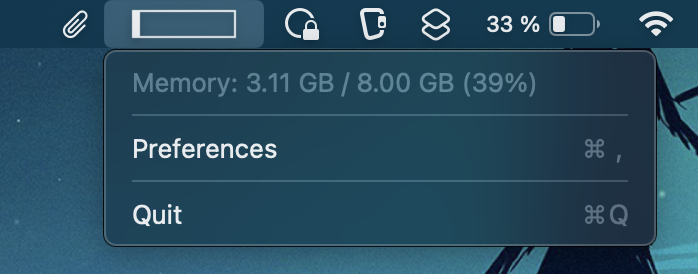
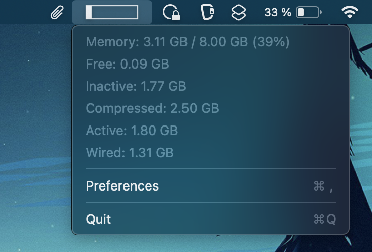

# CPUMonitor
A macOS menubar app that shows memory and CPU usage.

## Features
The current CPU utilization is shown in the menu bar.

The menu bar item menu shows the current memory usage.

## Requirements and Versions
The standard version makes use of APIs that are only available on **MacOS13** and later. An older version for earlier versions of MacOS is included in the **MacOS12 branches**. The older version has fewer features, e.g. no start at login via app preferences.

## Installation
You can compile the app yourself using xcode `open project in xcode > cmd + b` or you can download a compiled version from [releases](https://github.com/Lennard599/CPUMonitor/releases).

## FAQ

**Why is the overall memory usage plus the free memory less than the total memory?**

The system will use as much memory as possible, so the free part is often very small. The overall memory usage shows only how much memory is actively used by the system.

Here are the different categories of memory
- Overall usage: active + wired
- Free: free memory
- Inactive: memory used by closed apps to speed up the next launch
- Compressed: compresed memory
- Active: actively used user memory
- Wired: actively used system (kernel) memory

## Links
[ClipBoardManager menu bar app](https://github.com/Lennard599/ClipBoardManager)